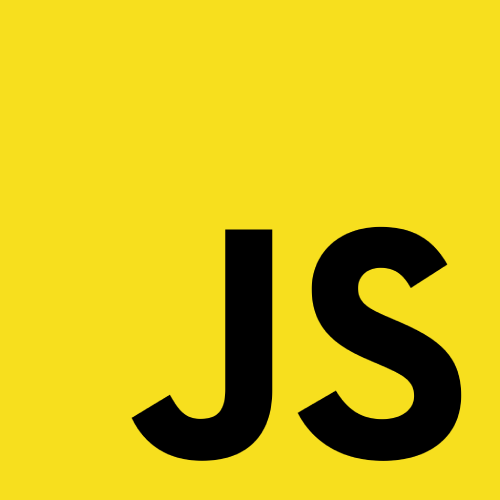

<h1 align="center">👋🏽 I'm Judá Teixeira. Welcome!</h1>
<h3 align="center">💻 A Full Stack developer and Computer Networks Engineer from Brazil</h3>

<!-- <h2 align="center">😉 About me</h2> -->

📍 Location: Natal, RN 🇧🇷 
🧒🏽 Pronouns: He / Him  
🌱 I’m learning: JavaScript, React, Ruby, RoR, and + at Microverse 
💼 I'm currently looking for new opportunities 
💬 Ask me about: cooking, traveling Brazil and dogs 
🎵 I play guitar, sing and write songs 

**📱 Get in touch:**
  &nbsp;
  &nbsp;
  &nbsp;

 

  <h2 align="center">🥷🏽 What I do</h2>
  
  

    <h4>Languages I speak</h4>
      &nbsp;
      &nbsp;
      &nbsp;
  

