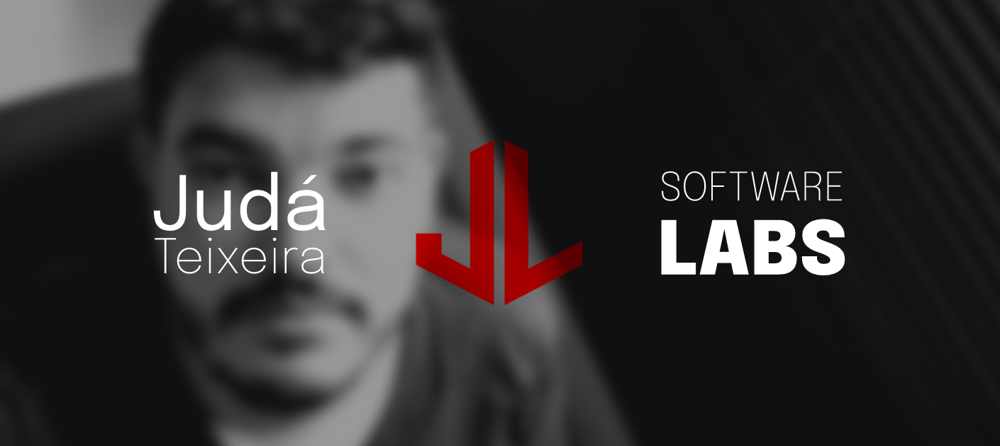

<h1 align="center">👋🏽 I'm Judá Teixeira. Welcome!</h1>
<h3 align="center">💻 A Full Stack developer and Computer Networks Engineer from Brazil</h3>

<h2 align="center">😉 About me</h2>

📍 Location: Natal, Brazil 🇧🇷 
🧒🏽 Pronouns: He / Him  
🌱 I’m learning: JavaScript, React, Ruby, RoR, and + at Microverse 
💼 I'm currently looking for new opportunities 
💬 Ask me about: cooking, traveling Brazil and dogs 
🎵 I play guitar, sing and write songs 

 
<h2 align="center">📱 How to reach me</h2>

  &nbsp;   &nbsp;   &nbsp; 

 
<h2 align="center">📊 My stats </h2>

